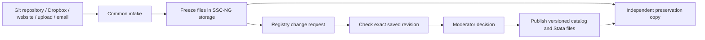

# SSC-NG architecture — local baseline 0.1.0

Updated 2026-09-28. This is the design reference; use [README.md](../README.md)
for running the demo, uploading the smoke packages, and the version history.
“Current” below describes implemented behavior; “proposed” describes future work.

## 1. Place within the published project

The [SSC-NG homepage](https://ssc-ng.net/) describes modernization of the Stata
archive and currently directs submissions to the legacy service. Our localhost
pilot is a separate development demonstration.

The [development plan](https://ssc-ng.net/development-plan/) places the relevant
architecture in Task 2: email and web intake, a central GitHub catalog reviewed
through pull requests, compatible installation, independent package copies,
and recoverable archives. Task 4 extends submission automation, version metadata,
dependencies, documentation, and citation. This small pilot explores those
technical foundations; it does not complete a project task or replace governance.

The working design is **one registry change request per proposed package
release**. A pull request proposes a catalog change; it is not a package download.
Authors can keep their development files wherever they choose. A web or email
intake adapter can create the registry request on their behalf. This follows the
central-catalog direction while allowing a future review host other than GitHub.

Moderation records whether a submission is appropriate and meets the agreed
requirements. Passing a smoke test does not establish scientific correctness.

## 2. Separate four kinds of records

| Record | Example | Purpose |
| --- | --- | --- |
| Application history | SSC-NG local baseline `0.1.0` | Changes to this website, server, and documentation |
| Author's development history | Repository URL, full commit ID, package subdirectory | Original reference and provenance; available only when supplied |
| Package release | `sscng_smoke@1.0.0` plus the ZIP SHA-256 | Exact installable content preserved by SSC-NG |
| Submission/review history | Request ID, revision, metadata, checks, decision | Why particular bytes became an accepted release |

A Git tag, a package version, and a storage checksum answer different questions.
A tag is a human label that can move. A full Git commit identifies a repository
snapshot. A SHA-256 identifies specific bytes. The registry must also keep those
bytes: a checksum alone cannot recover a deleted file.

Existing systems illustrate the separation:

| System | Useful lesson |
| --- | --- |
| [CRAN](https://cran.r-project.org/src/contrib/Archive/digest/) | Distribute package archives and keep earlier release archives. |
| [Bioconductor](https://contributions.bioconductor.org/git-version-control.html) | Maintain project-controlled Git history independently of an optional GitHub remote. |
| [Homebrew](https://docs.brew.sh/Formula-Cookbook) | Keep a small installation recipe identifying source URLs and checksums; development source and distribution artifacts serve different roles. |

## 3. What the local pilot actually stores

The default data root is `.sscng/` under the project. `--data-dir` can select a
different root. `.sscng/` and its descendants are excluded from Git; another
custom location needs its own exclusion if it is inside a source repository.

| Path relative to data root | Contents |
| --- | --- |
| `registry.sqlite3` | Package metadata, submission IDs, hashes, checks/logs, approvals, releases, and catalog captures |
| `submissions/<id>/source.zip` | Original uploaded ZIP, saved before Stata checks; retained even when checks fail |
| `jobs/<id>/` | Extracted files, runner output, and temporary installation libraries for checks |
| `environment/jobs/<id>/` | Installations and output from restoring archived releases |
| `examples/` | Rebuildable ZIPs for the older built-in dependency demonstration |

Approval creates a release record pointing to the existing submission ZIP; it
does not make another release ZIP. Downloads and Stata installation read that
saved archive and verify its checksum. An accepted name/version cannot be
overwritten. Version `1.1.0` therefore leaves `1.0.0` available.

Current limitations: repeated submissions can store identical ZIPs more than
once; job directories also duplicate extracted files. There is no cross-submission
deduplication, structured upstream URL/commit capture, remote-source importer,
real hosted PR integration, or independently verified backup. The local operator
approves candidates; authentication and multi-user permissions are not implemented.

## 4. Proposed neutral submission and preservation workflow



1. **Receive and record provenance.** Assign a provider-independent submission ID.
   Record the original project/directory link, source kind, package subdirectory,
   author-supplied version, and the person making the submission.
2. **Capture once.** Fetch or accept the full package, validate it, compute its
   hashes, and store an immutable candidate before scheduling checks. A source
   fetch is incomplete until all required package files are captured. Mirror the
   captured object and metadata to an independent destination; record whether
   backup is pending or verified rather than treating a local copy as a backup.
3. **Open a registry request.** Point the proposed catalog entry at this captured
   object. Form/email submitters need no account at the author's hosting provider.
   In the first implementation, a service account can create a central catalog
   PR; the provider's PR number is a reference, not the internal identity.
4. **Check and review that revision.** Pin metadata, bundle hash, dependency hashes,
   check environment, and request revision together. A changed candidate creates
   a new revision and invalidates the previous approval. Checks run on request
   creation/update, not continuously over all upstream repositories.
5. **Publish exactly what passed.** Approval points a new immutable package
   version at the checked bytes; it never downloads “latest” again. Package pages
   show both the original source link and an SSC-NG archived download/install URL.
   Normal publication should require verified independent preservation first.

| Author's platform | Intake rule | Evidence retained |
| --- | --- | --- |
| GitHub, GitLab, Bitbucket, or another Git server | Resolve requested revision to a full commit; capture selected package files | Repository/directory link, subdirectory, requested tag/branch, full commit, bundle hash; capture required LFS/submodule files explicitly |
| Dropbox or another shared folder | Prefer one uploaded ZIP or downloadable ZIP snapshot | Original share/directory link, retrieval time, file manifest, package version, bundle hash; provider revision ID if available |
| Ordinary website | Download a declared package archive and validate contents | Project/directory link, download URL, retrieval time, bundle hash |
| Local upload or email | Accept an attachment through the same intake service | Submitter, received time, optional original directory link, attachment hash; mark origin as unavailable if none is supplied |

A provider adapter translates its links, authentication, and event format into
this common record. There is no promise that every arbitrary URL already works.
Private sources require authorized access; temporary download credentials must
not become public catalog links. For a changing folder, downloading files one
at a time can mix two versions: require a coherent ZIP or verify a stable folder
listing and file revisions, retrying if they change during capture.

**Dropbox example:** capture version `1.0.0` from an author's shared directory and
save object `H1`. Later the author replaces its files with `1.1.0`; a new request
captures object `H2`, keeping the same reference link. After approval, both versions
resolve through SSC-NG. Deleting the shared folder affects the reference link,
but the captured versions remain installable. Changes that were overwritten
before any submission cannot be reconstructed by SSC-NG.

Proposed manifest fields (a schema sketch, not the current upload API):

```text
package: name, version, title, maintainer, license, minimum_stata
dependencies: [{name, version, sha256}]
source: kind, directory_url, download_url, package_subdirectory,
        requested_revision, resolved_commit_or_provider_revision, captured_at
artifact: sha256, byte_count, files[{path, sha256, size}], storage_key
review: request_id, revision_id, candidate_fingerprint,
        checks[{environment, dependency_hashes, result, log_key}], decision
preservation: replica_location, verified_at, backup_checkpoint
```

Only fields applicable to a provider are populated. A local path can be recorded
privately as provenance, but it is not a public reference URL. Each later request
compares its captured files against the previously approved manifest, not against
the current contents of the author's mutable folder.

## 5. Keep all versions without unnecessary copies

Start with **one compressed ZIP per unique hash**, plus small metadata records:

```text
objects/sha256/ab/abcdef...zip       # immutable package bytes
catalog/sscng_smoke/1.0.0.json       # points to H1
catalog/sscng_smoke/1.1.0.json       # points to H2
requests/<id>/<revision>.json       # can reuse H1 or H2
captures/<date>.json                # version/hash references, not copied ZIPs
```

Compute hashes on receipt; write a new object atomically only when absent, and
verify an existing object before reusing it. Retries, approvals, and date-based
catalog captures reference the same object. Updating the “latest” pointer does
not alter an older version. Keep dependency objects pinned by accepted manifests.

ZIP hashing deduplicates identical archives, **not** shared files inside different
ZIPs. Different ZIP timestamps can also produce different archive hashes. Our
smoke builder uses stable ZIP metadata so repeated builds of identical sources
produce identical bytes. Retain exact author-uploaded bytes when preserving
submission evidence; a normalized file-tree hash may additionally identify
equivalent contents.

For small Stata packages, whole compressed releases are a simple starting point.
If measured storage growth warrants it, add file-level content addressing: each
version's manifest maps filenames to hashes, and unchanged files are stored once.
Serve reconstructed `.pkg`/`.ado` files from that manifest and cache install trees
as needed. Keeping original ZIP evidence still consumes space; file deduplication
does not remove that cost. Avoid a chain of patches as the only recovery method.

Preserve accepted objects and anything referenced by review/retention records.
Only reclaim unreferenced objects after a defined retention period and reference
audit. Derived check libraries may be cleaned after necessary logs are preserved.
Independent backup copies are intentional redundancy and must survive deduplication.

## 6. A workable plan without GitHub

**Recommendation:** keep Git for application/catalog history, use an
institution-operated [Forgejo](https://forgejo.org/docs/latest/) service for
repositories and PR review, and keep package objects in independent storage
served over HTTPS. A managed GitLab service is another option; plain Git over SSH
works for history but needs a separate review interface. Hosting and maintenance
responsibility remain with SSC-NG or its institution.

| Component | With GitHub initially | Independent replacement |
| --- | --- | --- |
| Application and catalog history | Git repositories on GitHub | Git repositories on institution-operated Forgejo |
| PR discussion, permissions, decisions | GitHub PRs/accounts | Forgejo PRs/accounts, with exported review records |
| Package files | SSC-NG-owned artifact storage | Same storage; no dependency on GitHub download URLs |
| Checks | PR-triggered worker | Independent worker consuming the same internal request |
| Website and Stata endpoints | SSC-NG domain and web server | Same stable domain or documented mirror endpoint |

Git history can be transferred using [Git bundles](https://git-scm.com/docs/git-bundle).
Bundles do not preserve uncommitted work, `.sscng/`, hosted PR discussions, or
separate LFS objects. Export those separately. Local uncommitted work therefore
needs a filesystem backup while commits are paused.

For package storage, begin with a managed institutional filesystem and a second
independent copy; use object storage with an S3-compatible interface when it
helps operations. Choose providers, capacity, and retention after measuring need.
The interface is portable; redundancy is an operational property, not a product
name. Do not put every ZIP into the catalog Git repository.

Retain database snapshots, immutable objects, request records, and recovery
configuration in a second administrative/storage failure domain. Use a consistent
[SQLite backup](https://www.sqlite.org/backup.html) for a running local registry,
then include every object that snapshot references. A synchronized folder can
propagate deletion and is not a tested recovery procedure. Archival deposits to
Zenodo or Dataverse can supplement operational backups; evaluate their policies
and recovery/API behavior before adoption.

**Outage test:** disconnect GitHub and the author's source host, restore catalog,
records, and objects into a clean service, then install both smoke versions from
SSC-NG and confirm results `4` and `5`. Already captured candidates can continue
through independent review/check infrastructure. A new uncaptured GitHub source
must wait for recovery or be supplied as an authorized upload. Restoring downloads
alone does not prove that authentication and new submissions survive the outage.

## 7. Next local milestones (proposed, not release commitments)

1. **0.1.1 — provenance and storage:** add structured source links to form/API and
   package pages; immutable object storage; migration checks for existing ZIPs;
   preserve two submissions from the same overwritten source link.
2. **0.1.2 — actual registry requests:** connect one central catalog PR workflow,
   then bridge ZIP/form intake into it. Capture candidates before checks and bind
   approval to the exact request revision. Add an email intake path when agreed.
3. **0.1.3 — recovery demonstration:** independent replica and catalog/database
   backups; restore without the author host or GitHub; document recovery time and
   the maximum interval of records at risk between backups.

Before public execution, add authenticated roles, protected fetches, and disposable
isolated workers that cannot access publication credentials. The current Stata
runner executes trusted code with this Mac user's permissions; separate working
directories are not an operating-system sandbox. Wider Stata-version/OS coverage,
legacy SSC/RePEc integration, and community review remain subsequent work.
