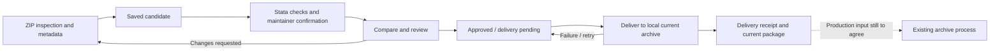

# SSC-NG submission architecture — local baseline 0.1.0

Updated 2026-10-05. Use [README.md](../README.md) to run the demo and exercise a
submission followed by an update.

## Scope and archive handoff

The submission system receives proposed Stata packages, checks their exact files,
records maintainer confirmation and human review, and delivers approved files to
**today’s current archive**. Approval and delivery have distinct states. There is
one current output per package; a successfully delivered update replaces it.

Archive preservation and versioned history already have an established process
in [ssc-ng/archive](https://github.com/ssc-ng/archive/). That process is the
downstream owner of historical snapshots and retrieval. The
submission demo therefore does not need its own archive storage redesign,
scheduled catalog snapshots, or historical installation interface.

The implemented destination is local. The demo does not update the live SSC
archive, create a hosted pull request, or commit/push to `ssc-ng/archive`.

## Five submission priorities

| Priority | Implemented behavior |
| --- | --- |
| Define the archive handoff | The destination view exposes the local layout and boundary. An approved handoff ZIP includes the exact installable files and a manifest with candidate identity, checksums, expected current package, and removals. The actual production input is still unknown. |
| Straightforward, authorized submission | Bounded ZIP inspection imports supported `metadata.json` fields and explicit `.pkg` hints without execution. Authors review and edit the form. Updates use the recorded maintainer contact and need confirmation specific to the candidate. |
| Useful Stata checks | Check metadata, safe paths, inventory completeness, explicit version consistency, dependencies, minimum runtime, installation, and the selected `.do` test. Failures carry remedies; a download supplies the candidate and a local reproduction recipe. |
| Efficient review | Show differences from today's package, preserve earlier revision feedback, and record reviewer name, note, and decision. New revisions need fresh checks and confirmation. A candidate based on an outdated current package must be revised. |
| Dependable delivery | Approved candidates have a separate pending delivery. Track attempts, errors, and receipts; restore prior files on failure; recover interrupted writes on restart; permit safe retries without approving again. |

The author’s development repository can remain anywhere. ZIP submission is the
implemented intake route; an optional project URL supplies context, not remote
code execution or automatic repository import.

### Workflow references and design choices

- [CRAN submission policy](https://cran.r-project.org/web/packages/policies.html#Submission)
  provides the main author model: submit a package, confirm the maintainer,
  address check results, and explain a resubmission. Here the transport is a
  Stata ZIP and confirmation is demonstrated locally.
- [Bioconductor’s current submitter guide](https://github.com/Bioconductor/BiocContributions/blob/devel/docs/submitters.md)
  informs visible check states, human review, and revisions that retain feedback.
  This demo adopts that review structure without requiring its GitHub and build
  infrastructure or its domain-specific package policies.
- [Homebrew’s contribution guide](https://docs.brew.sh/Adding-Software-to-Homebrew)
  informs exact reviewed source, checksums, explicit dependencies, and a meaningful
  installation test. Container registries and binary bottle distribution do not
  determine the submission workflow implemented here.

Passing checks provides evidence for review; it does not establish scientific
correctness. Package versions remain useful submission metadata even though the
delivery destination contains only the current accepted package.

### Candidate checks and confirmation

Each saved candidate has an exact ZIP checksum and a fingerprint binding that
checksum to the submitted metadata. Approval requires the same fingerprint to
have passing checks and verified demo confirmation. The service checks source
integrity again at approval and delivery, along with the checked dependencies.

Confirmation codes are single-use, expire after 30 minutes, and allow five failed
attempts before a new code is needed. They appear in a **visible demo mailbox**;
no email is sent. This tests the workflow and update-contact rules, not real
email possession. Reviewer names are operator-entered audit details, not
authenticated identities or enforced reviewer roles.

The demo requires `X.Y.Z` versions and exact dependency versions; these are local
prototype rules, not assertions about official SSC requirements. A test defaults
to `smoke.do`; optional `test_file` can identify another safe package-relative
`.do` path. The inventory needs an ado command and help file. Dependency sources
must match the currently delivered local records, and checks use a
fresh Stata library. The
reproduction kit contains the candidate, instructions, and a Stata do-file;
dependency sources must be supplied separately at the reviewed versions.

The form requires explicit trust before code execution. Local library isolation
is not an operating-system sandbox. Runtime validation currently covers Stata
19.5; the fixtures declare Stata 16, which has not been verified in this work.

## Local implementation

The default data root is `.sscng/`; `--data-dir` selects another root. `.sscng/`
is excluded from Git.

`/api/state` reports an API revision separate from the application version. The
page checks this before enabling write requests. An outdated running process
shows a restart message instead of accepting an unsupported workflow; polling
reconnects after restart without clearing the selected ZIP or form.

| Component | Responsibility |
| --- | --- |
| `index.html`, `assets/` | Submit, checks/review, and today’s archive views |
| `pilot/intake.py` | Metadata import, inventory inspection, and reproduction downloads |
| `pilot/packages.py` | ZIP and Stata package validation; Stata check execution |
| `pilot/service.py` | Submission queue, approval gates, and HTTP endpoints |
| `pilot/workflow.py` | Demo confirmation, recorded maintainers, and review comparisons |
| `pilot/delivery.py` | Approval, handoff plans/bundles, delivery attempts, receipts, and recovery |
| `pilot/archive.py` | Current file ownership, writes, and durable undo journals |
| `registry.sqlite3` | Metadata, checks, confirmations, reviews, deliveries, and current package references |
| `submissions/<id>/source.zip` | Exact candidate bytes, including unsuccessful submissions |
| `jobs/<id>/` | Check workspaces and runner output |
| `current-archive/<letter>/` | Current `.pkg` and inventory files, grouped by the package’s first letter |
| `delivery-journals/` | Undo information for in-progress local delivery |

For `sscng_trial`, the descriptor is
`.sscng/current-archive/s/sscng_trial.pkg`. The HTTP installation base is
`/archive/s/`; `/api/archive/sscng_trial/download` produces a ZIP of the current
published files. The original submitted ZIP remains available from its review
record. The current archive API selects the currently published submission, not
an arbitrary historical package version.

The handoff manifest (`ssc-ng-reviewed-handoff-v1`) is the integration contract.
It identifies the approved source/fingerprint, reviewed time, expected base,
installable files and hashes, and added/changed/removed paths. The local adapter
maintains the letter bucket’s `stata.toc`. A production adapter must apply these
changes through the input agreed with the archive operators; publishing the
GitHub mirror directly is not assumed to be that input.

## Delivery and recovery

Approval records the reviewed fingerprint and reserves the candidate, without
writing the current package or creating a release record. Delivery rechecks
integrity, dependencies, the current base, newer-version ordering, file ownership,
and destination conflicts. A process lock serializes local writers.

Before changing files, the adapter persists an undo journal. Each file is replaced
atomically; the delivery receipt, release record, and current package reference
commit in a database transaction after the files are written. Ordinary failures
roll back the files and retain an approved candidate with a failed delivery
attempt. Retrying an already completed delivery returns its saved receipt.

After an abrupt stop, startup checks each journal against the committed receipt.
Uncommitted work is restored and marked for retry; committed work is retained.
If files were changed outside the service, recovery reports a conflict and blocks
further writes until the operator resolves it. This gives the local adapter
recovery across restarts. A future production handoff must still coordinate with
external readers: atomic individual file replacement is not a transaction across
all files for a separate mirror process.

## Existing data and compatibility

Existing submission ZIPs, review records, and legacy release records remain
available internally for compatibility and review evidence. New dependency
checks require the exact version to be delivered in the current local archive.
An accepted name/version still cannot be overwritten; a package update uses a
new version and goes through checks and approval.

Legacy approvals are not automatically exported into the new current archive
when the service starts. An old approval without a delivery record requires a
new reviewed submission. Only successful new deliveries create release records
and change the current output. Existing historical data is
preserved, but historical restore, catalog snapshots, maintainer transfers, and
versioned package-installation endpoints have been removed. Existing legacy
database tables and settings are left untouched; new databases omit those tables.
Keeping submission evidence is distinct from operating the downstream historical
archive; it records what was submitted, checked, and approved.

Completed unpublished candidates can be revised. Revising an approved candidate
whose delivery is pending or failed supersedes that approval and cancels its
delivery; the new revision must pass checks, confirmation, and review. A delivered
package update uses a new version. Neither action rewrites the earlier evidence.

## Remaining production integration

- **Connect the archive destination.** Confirm the live current archive’s file
  conventions and required metadata with its operators. Agree on access, how a
  package update is accepted, and how its acknowledgment maps to the receipt.
  Local files and a downloadable handoff bundle are implemented; live publication
  is not connected.
- **Replace simulated identity.** Connect real email delivery and authenticated
  author/reviewer roles. Agree on maintainer changes and review policy. The local
  demo mailbox and recorded reviewer names provide no multi-user authentication.
- **Prepare hosted checks.** Use isolated disposable workers for untrusted
  submissions, keep publication credentials away from those workers, and agree
  on supported Stata versions and platforms. Separate local working directories
  are not an operating-system sandbox. Choose and test the supported Stata
  version/platform matrix before claiming broader compatibility.
- **Extend intake when needed.** Email or repository-source intake can feed the
  same saved-candidate/check/review flow. Such adapters should capture exact files
  before checking them; none is required for the current ZIP submission demo.

Archive history, storage-provider selection, deduplication, backups, and older
version restoration belong to the established archive work rather than this
submission prototype’s roadmap.
